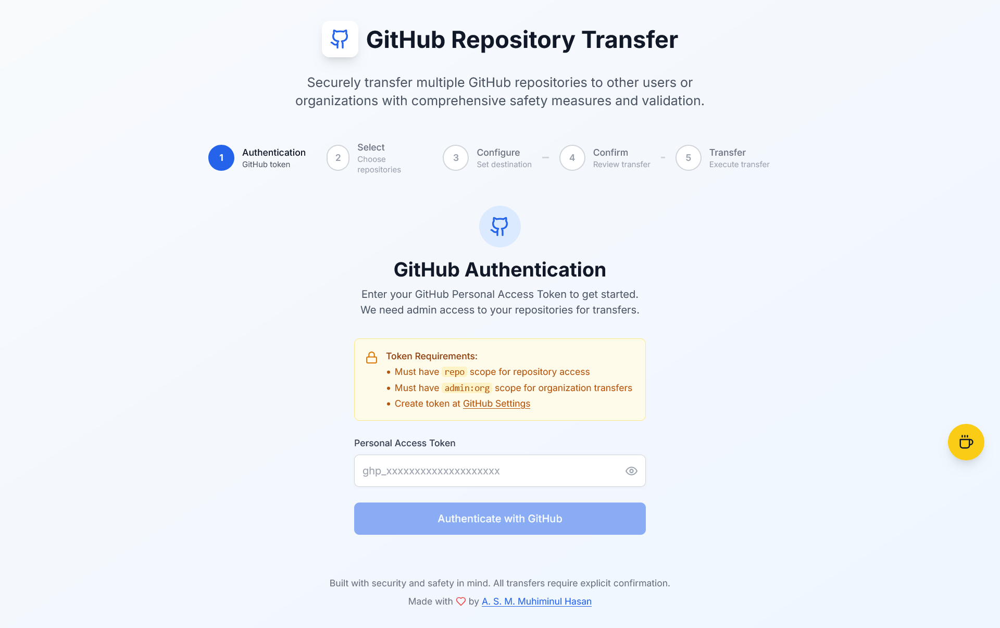

# GitHub Multi-Repository Transfer

A secure, user-friendly web application for transferring multiple GitHub repositories to other users or organizations with comprehensive safety measures and validation.

**Note**: This application does not send any request to the server. It only uses the token for authentication and local data management. Therefore, your token is safe and secure.


## 🔍 Overview

GitHub Multi-Repository Transfer is a modern React application that simplifies the process of transferring multiple GitHub repositories to other users or organizations. Built with security and user experience in mind, it provides a step-by-step guided process with comprehensive validation and safety checks.

The application eliminates the tedious process of manually transferring repositories one by one through GitHub's web interface, making it especially useful for:

- **Organizations** restructuring their repository ownership
- **Developers** transferring personal projects to organizations
- **Teams** consolidating repositories under different accounts
- **Companies** migrating repositories during acquisitions or reorganizations

## ✨ Features

### 🔐 **Secure Authentication**
- Personal Access Token authentication
- Token validation and rate limit checking
- Secure token storage with automatic cleanup
- Session management with logout functionality

### 📊 **Comprehensive Repository Management**
- View all personal and organization repositories
- Real-time repository information (stars, forks, language)
- Multi-selection with bulk operations
- Repository filtering and search capabilities

### 🎯 **Smart Destination Validation**
- Real-time username/organization validation
- Automatic user type detection (User vs Organization)
- Destination existence verification
- Caching for improved performance

### 🛡️ **Safety & Validation**
- Step-by-step guided process
- Comprehensive transfer confirmation
- Real-time progress tracking
- Detailed error handling and reporting

### 🎨 **Modern User Interface**
- Responsive design for all devices
- Intuitive step-by-step workflow
- Real-time loading states and feedback
- Beautiful gradient backgrounds and animations

### 📈 **Performance Optimized**
- Efficient API calls with rate limit respect
- Caching for user validation
- Optimistic UI updates
- Minimal re-renders with React hooks

## 🖼️ Screenshots




## 🛠️ Technology Stack

### **Frontend Framework**
- **React 18.3.1** - Modern React with hooks and concurrent features
- **TypeScript 5.5.3** - Type-safe development experience
- **Vite 5.4.2** - Lightning-fast build tool and dev server

### **Styling & UI**
- **Tailwind CSS 3.4.1** - Utility-first CSS framework
- **Lucide React 0.344.0** - Beautiful and consistent icons
- **PostCSS 8.4.35** - CSS processing and optimization

### **GitHub Integration**
- **@octokit/rest 22.0.0** - Official GitHub REST API client
- **Custom GitHub Service Layer** - Abstracted API interactions

### **Development Tools**
- **ESLint 9.9.1** - Code linting and style enforcement
- **TypeScript ESLint 8.3.0** - TypeScript-specific linting rules
- **Autoprefixer 10.4.18** - Automatic vendor prefix handling

### **Date & Time**
- **date-fns 4.1.0** - Modern date utility library

## 🚀 Getting Started

### Prerequisites

Ensure you have the following installed on your system:

- **Node.js** (version 16.0.0 or higher)
- **npm** (version 7.0.0 or higher) or **yarn**
- **Git** for cloning the repository
- A **GitHub account** with repositories to transfer
- A **GitHub Personal Access Token** with appropriate permissions

### Installation

1. **Clone the repository**
   ```bash
   git clone https://github.com/muhiminulhasan/github-multi-repo-transfer.git
   cd github-multi-repo-transfer
   ```

2. **Install dependencies**
   ```bash
   bun install
   # or
   npm install
   # or
   yarn install
   ```

### Running the Application

1. **Start the development server**
   ```bash
   bun run dev
   # or
   npm run dev
   # or
   yarn dev
   ```

2. **Open your browser**
   
   Navigate to `http://localhost:5173` to view the application.

3. **Build for production**
   ```bash
   bun run build
   # or
   npm run build
   # or
   yarn build
   ```

4. **Preview production build**
   ```bash
   bun run preview
   # or
   npm run preview
   # or
   yarn preview
   ```

## 📚 Usage

### Step-by-Step Guide

1. **🔐 Authentication**
   - Enter your GitHub Personal Access Token
   - The application will validate your token and load your repositories

2. **📋 Select Repositories**
   - Browse through your personal and organization repositories
   - Select multiple repositories you want to transfer
   - Use the search and filter options to find specific repositories

3. **🎯 Configure Destination**
   - Enter the target username or organization name
   - The application will validate the destination in real-time
   - Choose whether you're transferring to a user or organization

4. **✅ Confirm Transfer**
   - Review all selected repositories and destination details
   - Double-check the transfer configuration
   - Confirm to proceed with the transfer

5. **🚀 Transfer Process**
   - Monitor real-time progress of each repository transfer
   - View success/failure status for each repository
   - Get detailed error messages for any failed transfers

### Important Notes

- **Repository transfers are permanent** and cannot be undone through this application
- You must be the **owner** of the repositories you want to transfer
- The destination user/organization must **exist** and be able to receive repositories
- Some transfers may require **additional permissions** on the destination side

## 🔑 GitHub Token Setup

To use this application, you need a GitHub **Personal Access Token (classic)** with the following permissions:

### Required Scopes

- `repo` - Full access to private and public repositories
- `read:org` - Read organization membership and teams
- `read:user` - Read user profile information

### Creating a Token

1. Go to [GitHub Settings > Developer settings > Personal access tokens (classic)](https://github.com/settings/tokens)
2. Click "Generate new token (classic)"
3. Select the required scopes listed above
4. Set an appropriate expiration date
5. Generate and copy the token
6. Paste the token in the input field in the application
7. **Keep your token secure** - treat it like a password

### Token Security

- ✅ Store tokens securely in the application (localStorage)
- ✅ Never share your token with others
- ✅ Use tokens with minimal required permissions
- ✅ Set appropriate expiration dates
- ❌ Never commit tokens to version control
- ❌ Never share tokens in public channels

## 🛡️ Safety Features

### Pre-Transfer Validation
- **Token validation** with rate limit checking
- **Repository ownership verification**
- **Destination user/organization existence check**
- **Transfer eligibility validation**

### During Transfer
- **Rate limit compliance** with automatic delays
- **Individual transfer tracking** with detailed results
- **Error handling and recovery** for failed transfers
- **Progress monitoring** with real-time updates

### Post-Transfer
- **Comprehensive result reporting** with success/failure status
- **Error details and troubleshooting** information
- **Transfer history tracking** (session-based)

### Data Security
- **Local token storage** with automatic cleanup on logout
- **No server-side data persistence**
- **Secure API communication** using official GitHub SDK
- **Client-side only architecture** for maximum privacy

## 📁 Project Structure

```
github-multi-repo-transfer/
├── src/
│   ├── components/          # React components
│   │   ├── AuthStep.tsx     # Authentication step
│   │   ├── ConfigureStep.tsx # Destination configuration
│   │   ├── ConfirmStep.tsx  # Transfer confirmation
│   │   ├── SelectStep.tsx   # Repository selection
│   │   ├── StepIndicator.tsx # Progress indicator
│   │   └── TransferStep.tsx # Transfer progress
│   ├── hooks/              # Custom React hooks
│   │   └── useGitHub.ts    # GitHub API integration hook
│   ├── services/           # Service layer
│   │   └── github.ts       # GitHub API service
│   ├── types/              # TypeScript type definitions
│   │   └── github.ts       # GitHub-related types
│   ├── App.tsx             # Main application component
│   ├── index.css           # Global styles and Tailwind imports
│   ├── main.tsx            # Application entry point
│   └── vite-env.d.ts       # Vite environment types
├── public/                 # Static assets
├── eslint.config.js        # ESLint configuration
├── index.html              # HTML template
├── package.json            # Dependencies and scripts
├── postcss.config.js       # PostCSS configuration
├── tailwind.config.js      # Tailwind CSS configuration
├── tsconfig.json           # TypeScript configuration
├── tsconfig.app.json       # App-specific TypeScript config
├── tsconfig.node.json      # Node.js TypeScript config
└── vite.config.ts          # Vite configuration
```

## 🤝 Contributing

Contributions are welcome! Please feel free to submit a Pull Request. For major changes, please open an issue first to discuss what you would like to change.

### Development Guidelines

1. **Fork the repository**
2. **Create a feature branch** (`git checkout -b feature/amazing-feature`)
3. **Follow TypeScript and ESLint rules**
4. **Write clear, concise commit messages**
5. **Test your changes thoroughly**
6. **Update documentation** as needed
7. **Submit a pull request**

### Code Style

- Use **TypeScript** for all new code
- Follow **ESLint** rules and configurations
- Use **Tailwind CSS** for styling
- Write **clear, descriptive component names**
- Add **proper type definitions** for all interfaces

### Testing

- Test authentication flows with valid and invalid tokens
- Verify repository loading and selection functionality
- Test transfer validation and error handling
- Ensure responsive design works on all devices

## 📄 License

This project is licensed under the **MIT License** - see the [LICENSE](LICENSE) file for details.

## 👨‍💻 Author

**A. S. M. Muhiminul Hasan**

- GitHub: [@muhiminulhasan](https://github.com/muhiminulhasan)
- LinkedIn: [muhiminulhasan](https://linkedin.com/in/muhiminulhasan)

## ☕ Support

If you find this project helpful, consider buying me a coffee!

[](https://www.buymeacoffee.com/muhiminulhasan)

## 📞 Support & Feedback

- **Issues**: Report bugs or request features via [GitHub Issues](https://github.com/muhiminulhasan/github-multi-repo-transfer/issues)
- **Discussions**: Join conversations in [GitHub Discussions](https://github.com/muhiminulhasan/github-multi-repo-transfer/discussions)
- **Email**: Contact the author directly for support

---

**⭐ If you found this project helpful, please consider giving it a star!**

---

*This project is not affiliated with GitHub, Inc. GitHub is a trademark of GitHub, Inc.*